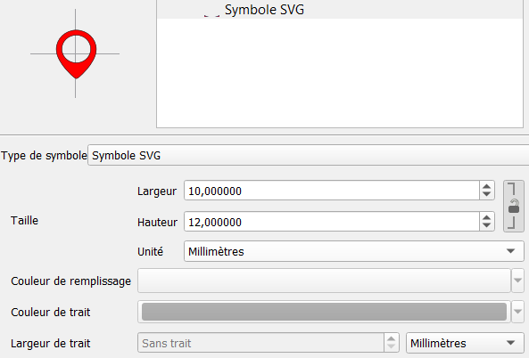
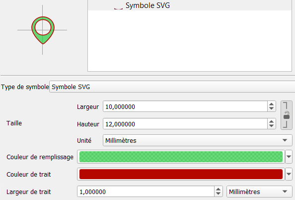

# What does this plugin do?
It allows adaptation of SVG files so that they're editable in QGIS.

# How?
It modifies all SVGs in a folder by replacing the parameters contained in the `path` tags and re-saving the new SVG in the format ` qgs_oldname.svg`.
The parameters taken into account are as follows:
* fill: `param (fill)`,
* fill-opacity: `param (fill-opacity)`,
* stroke: `param (outline)`,
* stroke-opacity: `param (outline-opacity)`,
* stroke-width: `param (outline-width)`.

# Example
Before modification:

    <path
        style="fill:none ; stroke:#000000 ; stroke-width:0.4"
    />

After modification:

    <path
        style="fill:none ; stroke:param(outline) #000000 ; stroke-width:param(outline-width) 0.4"
    />
